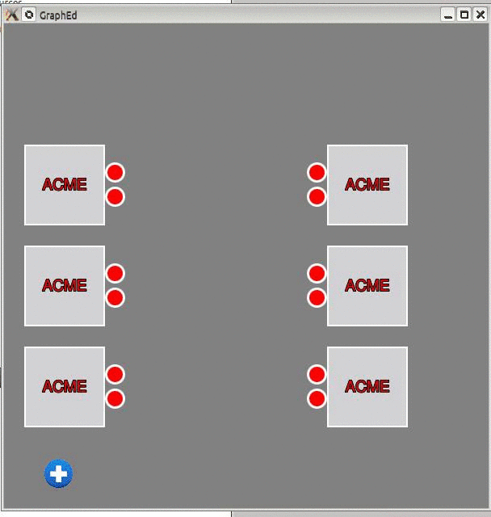

QML Graph Editor
================

This is just a technical proof of concept, aiming to create a visual Graph Editor. The core interest of this demo is to develop a working solution, so visuals aren't taken care at all.

It was implemented with the Qt 5 / Qt Quick framework technology, comprising a mix of QML and Javascript code.

